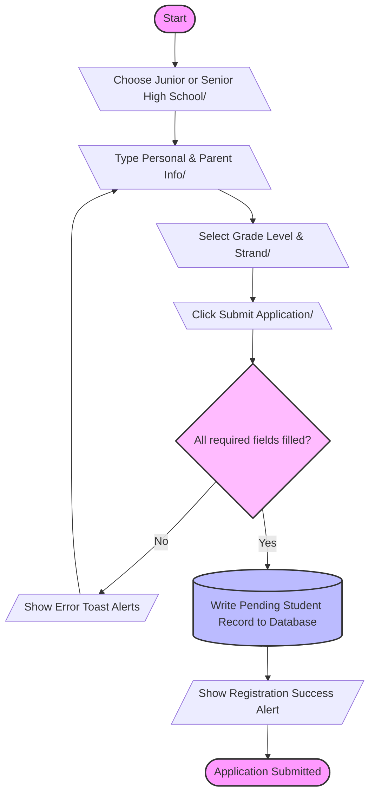
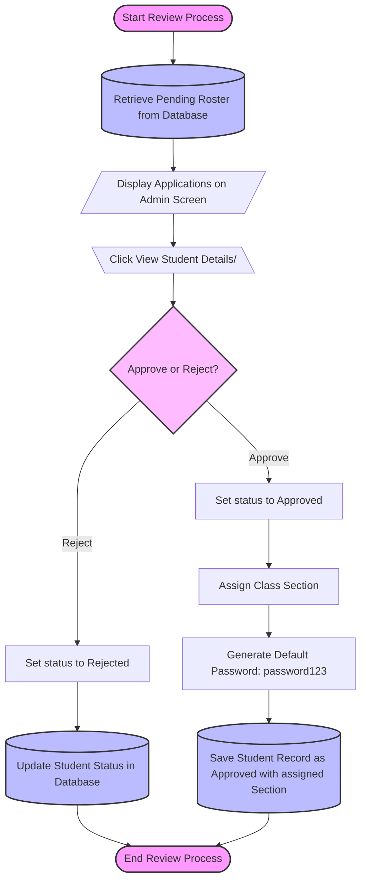
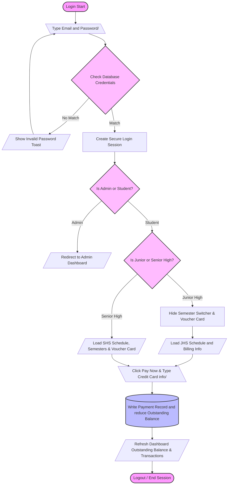

# Enrollment System Flowchart Guide

This guide contains easy-to-understand flowcharts of the JJKings Academy Enrollment System, designed for beginners or non-programmers. It maps out how a student registers, how an administrator reviews them, and how the student accesses their dashboard to pay fees.

---

## 🎨 Flowchart Symbols Key

* **([Oval])** : **Terminator** — Start or End of a process.
* **[Rectangle]** : **Process** — An action or operation performed by the system.
* **{Diamond}** : **Decision** — A decision point (Yes/No or True/False).
* **[/Parallelogram/]** : **Input/Output** — Entering data or showing/displaying info.
* **[\Trapezoid/\]** : **Manual Input** — Typing in information manually.
* **[(Cylinder)]** : **Database** — Stored data (students, schedules, payments, etc.).

---

## 🚀 1. Student Registration & Application Flow

This chart shows how a new student applies to the academy.

---

## 🏛️ 2. Administrative Review & Approval Flow

This chart shows how the school administrator processes pending applications.

---

## 💻 3. Student Login & Tuition Payment Flow

This chart shows how an approved student logs in and pays their fees.

